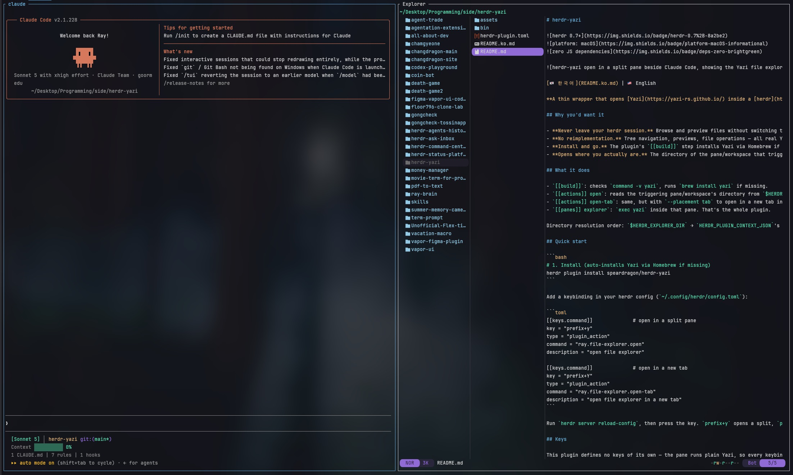

# herdr-yazi




🇰🇷 한국어 | [🇺🇸 English](README.md)

**[Yazi](https://yazi-rs.github.io/)를 [herdr](https://herdr.dev) pane 안에서 바로 띄워주는 얇은 래퍼 플러그인.** 파일 탐색·미리보기·파일 조작 전부 Yazi 본체가 그대로 처리한다 — 이 플러그인은 "지금 작업 중인 디렉토리를 정확히 찾아서 Yazi를 그 자리에 여는 것"만 책임진다.

## 왜 필요한가

- **VSCode로 안 넘어가도 됨.** 터미널(herdr) 세션을 벗어나지 않고 파일을 훑어보고 내용을 미리 볼 수 있다.
- **Yazi를 재구현하지 않는다.** 트리 탐색, 이미지/텍스트 프리뷰, 파일 조작 — 전부 실제 Yazi 바이너리가 하는 일이고, 이 플러그인은 그걸 herdr pane 안에 배치만 한다. 기능이 부족하면 Yazi 자체를 업데이트하면 된다.
- **설치가 곧 준비 끝.** macOS에서는 플러그인의 `[[build]]` 단계가 Homebrew로 Yazi를 자동 설치한다. Linux에서는 Yazi가 이미 설치되어 있어야 한다.
- **어디서 열든 그 자리에서 뜬다.** 키를 누른 pane의 워크스페이스 디렉토리를 herdr 컨텍스트에서 읽어 `--cwd`로 넘기기 때문에, 항상 "지금 작업 중이던 그 폴더"에서 Yazi가 열린다.

## 무엇을 하는가

- `[[build]]`: `command -v yazi`로 확인하고, macOS에서만 Yazi가 없으면 `brew install yazi`를 실행한다. Linux에서는 설치 안내와 함께 종료한다.
- `[[actions]] open`: 트리거된 pane/워크스페이스의 디렉토리를 `$HERDR_PLUGIN_CONTEXT_JSON`에서 읽어 `herdr plugin pane open --placement split --cwd`로 split pane을 연다.
- `[[actions]] open-tab`: 위와 동일하지만 `--placement tab`으로 새 탭에 연다.
- `[[panes]] explorer`: 그 pane 안에서 `exec yazi` — 그게 전부다.

디렉토리 해석 우선순위: `$HERDR_EXPLORER_DIR` → `HERDR_PLUGIN_CONTEXT_JSON`의 `focused_pane_cwd`/`workspace_cwd` → 현재 디렉토리.

## 빠른 시작

```bash
# 1. 설치 (Linux에서는 Yazi를 먼저 설치해야 함)
herdr plugin install speardragon/herdr-yazi
```

herdr 설정(`~/.config/herdr/config.toml`)에 키바인딩 추가:

```toml
[[keys.command]]              # split pane으로 열기
key = "prefix+y"
type = "plugin_action"
command = "ray.file-explorer.open"
description = "open file explorer"

[[keys.command]]              # 새 탭으로 열기
key = "prefix+Y"
type = "plugin_action"
command = "ray.file-explorer.open-tab"
description = "open file explorer in a new tab"
```

`herdr server reload-config` 실행 후 키를 누르면 끝. `prefix+y`는 split, `prefix+Y`(Shift+y)는 새 탭.

### 참고: Command Center로 등록하기

낱개 `prefix+<key>` 대신 [Command Center](https://github.com/speardragon/herdr-command-center)를 쓰고 있다면, herdr-yazi의 액션도 거기에 등록해서 같은 팝업에서 실행할 수 있다.

`commands.toml`에 추가한다 (`herdr plugin action invoke edit-config --plugin cdragon.command-center`로 열기):

```toml
[[commands]]
slot = "f"
label = "File explorer"
type = "plugin_action"
command = "ray.file-explorer.open"

[[commands]]
slot = "t"
label = "File explorer (new tab)"
type = "plugin_action"
command = "ray.file-explorer.open-tab"
```

위의 `[[keys.command]]` 방식도 그대로 잘 동작한다 — 별도 키를 더 쓰고 싶지 않을 때 고를 수 있는 선택지일 뿐이다.

## 키

이 플러그인은 자체 키를 정의하지 않는다 — pane 안에서 실행되는 건 순수 Yazi이므로, 모든 키는 [Yazi 공식 키바인딩 문서](https://yazi-rs.github.io/docs/keymap)를 따른다.

## 개발

```bash
herdr plugin link /path/to/herdr-yazi   # 로컬 개발용 링크 (build 단계는 실행 안 됨)
herdr plugin action invoke ray.file-explorer.open
```

`bin/resolve-dir.sh`는 독립 실행 가능한 셸 스크립트라 herdr 없이도 직접 테스트할 수 있다:

```bash
HERDR_PLUGIN_CONTEXT_JSON='{"focused_pane_cwd":"/some/dir"}' bin/resolve-dir.sh
```

## 요구 사항

macOS + [Homebrew](https://brew.sh/), 또는 Yazi가 설치된 Linux.

---

## 이런 플러그인도 만들었습니다

**[Command Center](https://github.com/speardragon/herdr-command-center)** — 플러그인을 하나둘 늘려가다 보니 어떤 `prefix+<key>`가 뭘 하는 건지 헷갈리기 시작하지 않으셨나요? 키 하나로 팝업을 열면 등록해둔 명령이 전부 뜨고, 옆에 붙은 슬롯 키만 누르면 바로 실행됩니다. 세 플러그인 전에 정해둔 바인딩을 `config.toml`에서 다시 뒤질 필요가 없어집니다.


```bash
herdr plugin install speardragon/herdr-command-center --yes
```

**[Plugin Manager](https://github.com/speardragon/herdr-plugin-manager)** — 플러그인을 설치·업데이트·삭제할 때마다 `herdr plugin ...` 명령어를 외워서 빈 pane에 치는 게 번거롭지 않으신가요? 이걸 사용하면 어떤 플러그인에 업데이트가 있는지 한눈에 보고, 켜고 끄고, 커뮤니티가 만든 플러그인까지 팝업 하나에서 둘러보고 설치할 수 있습니다.

|  |  |
| :---: | :---: |
| 메인 모습 | 마켓플레이스 모습 |

```bash
herdr plugin install speardragon/herdr-plugin-manager --yes
```
