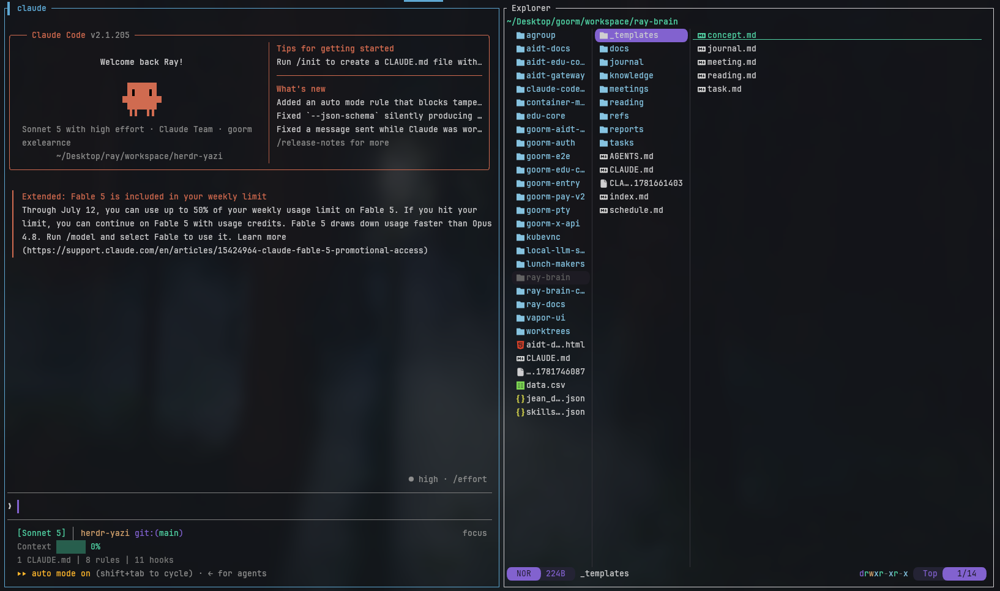

# herdr-yazi

[](https://github.com/Only-Moon/herdr-yazi-windows/actions/workflows/ci.yml)
[](LICENSE)


**A thin wrapper that opens [Yazi](https://yazi-rs.github.io/) inside a [herdr](https://herdr.dev) pane.** All file browsing, preview, and file operations are handled by Yazi itself — this plugin simply finds the directory you're working in and opens Yazi there.



## Why use it

- **Never leave your herdr session.** Browse and preview files without switching to VSCode or another editor.
- **No reimplementation.** Tree navigation, previews, file operations — all handled by Yazi itself. If a feature is missing, update Yazi itself.
- **Install and go.** The plugin's build step installs Yazi via Homebrew (macOS/Linux) or guides you through Windows installation options.
- **Opens where you are.** The directory of the pane/workspace that triggered the key is read from herdr's context and passed via `--cwd`, so Yazi always opens in the folder you were just working in.

## What it does

- `[[build]]`: Checks for `yazi` in PATH, installs via Homebrew (macOS/Linux) or shows Windows installation options.
- `[[actions]] open`: Reads the triggering pane/workspace directory from herdr's context and opens a split pane via `herdr plugin pane open --placement split --cwd`.
- `[[actions]] open-tab`: Same as above, but opens in a new tab with `--placement tab`.
- `[[panes]] explorer`: Runs `exec yazi` inside the pane — that's it.

Directory resolution priority: `$HERDR_EXPLORER_DIR` → `HERDR_PLUGIN_CONTEXT_JSON`'s `focused_pane_cwd`/`workspace_cwd` → current directory.

## Quick start

### macOS / Linux
```bash
# 1. Install (auto-installs Yazi via Homebrew if missing)
herdr plugin install Only-Moon/herdr-yazi-windows

# 2. Add keybindings to ~/.config/herdr/config.toml
[[keys.command]]
key = "prefix+y"
type = "plugin_action"
command = "ray.file-explorer.open"
description = "open file explorer"

[[keys.command]]
key = "prefix+Y"
type = "plugin_action"
command = "ray.file-explorer.open-tab"
description = "open file explorer in a new tab"
```

### Windows
```bash
# 1. Install Yazi first (required on Windows)
scoop install yazi
# or
winget install yazi

# 2. Install the plugin
herdr plugin install Only-Moon/herdr-yazi-windows

# 3. Add keybindings (note the -windows suffix for Windows-specific actions)
[[keys.command]]
key = "prefix+y"
type = "plugin_action"
command = "ray.file-explorer.open-windows"
description = "open file explorer (split)"

[[keys.command]]
key = "prefix+Y"
type = "plugin_action"
command = "ray.file-explorer.open-tab-windows"
description = "open file explorer in new tab"
```

Then run `herdr server reload-config` and press your key. `prefix+y` opens a split, `prefix+Y` (Shift+y) opens a new tab.

## Windows Support

Since herdr v0.8.0, native Windows pane spawning is fully supported:

- **Native pane spawning** — Uses herdr's `CreateProcessW` to spawn `yazi` directly as the pane's PID 1 (no shell, instant startup)
- **PATH shim** — Build script creates a symlink at `~/.local/bin/yazi.exe` so `command = ["yazi"]` works natively
- **Native launchers** — `open-windows` and `open-tab-windows` use native `plugin pane open`
- **Backward compatibility** — On herdr < v0.8.0, scripts fall back to `pane split` + `pane run` + `send-keys`

### Windows Requirements
- Windows 10/11 with herdr preview channel (required for native pane support)
- Yazi installed via Scoop, Winget, or Chocolatey
- `~/.local/bin` in PATH (for the Yazi shim)

## Keybindings

This plugin defines no keys of its own — the pane runs plain Yazi, so all keybindings follow [Yazi's official keymap](https://yazi-rs.github.io/docs/keymap).

## Development

```bash
# Local development
herdr plugin link /path/to/herdr-yazi   # local dev link (skips build step)

# Test actions
herdr plugin action invoke ray.file-explorer.open
herdr plugin action invoke ray.file-explorer.open-tab
herdr plugin action invoke ray.file-explorer.open-windows
herdr plugin action invoke ray.file-explorer.open-tab-windows
```

`bin/resolve-dir.sh` is a standalone shell script testable without herdr:

```bash
HERDR_PLUGIN_CONTEXT_JSON='{"focused_pane_cwd":"/some/dir"}' bin/resolve-dir.sh
```

## Requirements

- **macOS/Linux**: Homebrew
- **Windows**: Scoop, Winget, or Chocolatey (for Yazi); herdr preview channel

## Credits

Originally created by [ray-goorm](https://github.com/ray-goorm) (ray.kang@goorm.io) as `speardragon/herdr-yazi`. This fork adds native Windows support via herdr's v0.8+ pane spawning API.

## License

MIT License — see [LICENSE](LICENSE) for details.